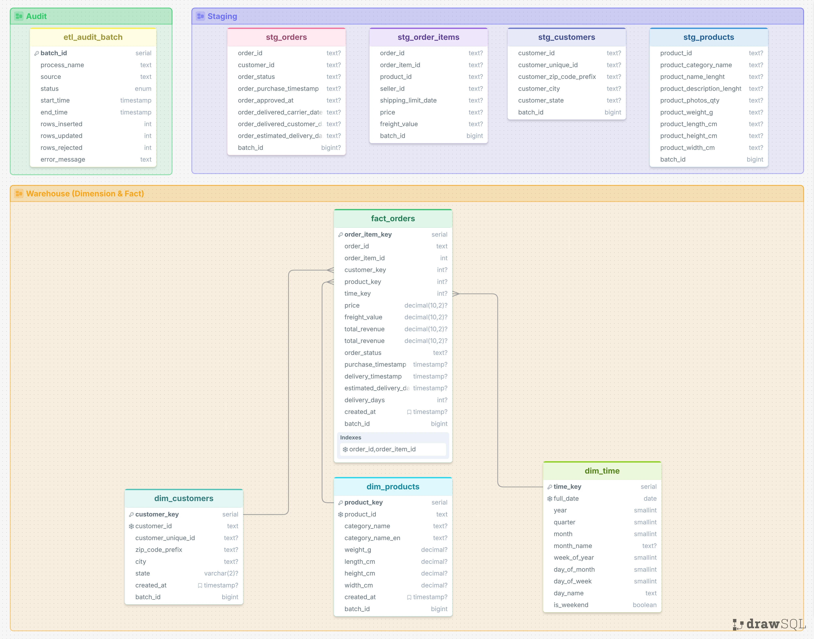

# Ecommerce Data Engineering Pipeline

Production-style batch data pipeline built on the Olist Brazilian E-Commerce dataset.

The project simulates a real-world Data Engineering workflow by implementing incremental warehouse loading, SCD Type 2 dimensions, audit logging, data quality validation, reconciliation checks, and automated testing.

## Architecture

```text
CSV Files
    │
    ▼
Ingestion (Python)
    │
    ▼
Staging Layer (PostgreSQL)
    │
    ▼
Validation & Data Quality Checks (Python)
    │
    ▼
Audit & Rejected Record Logging
    │
    ▼
SQL Transformations
    │
    ├── SCD Type 2 Dimensions
    ├── Incremental Fact Loading
    └── Time Dimension Population
    │
    ▼
Warehouse Layer
    │
    ▼
Reconciliation
```

## Data Model



### Warehouse Tables

#### Fact Table

* `warehouse.fact_orders`

#### Dimension Tables

* `warehouse.dim_customers` (SCD Type 2)
* `warehouse.dim_products` (SCD Type 2)
* `warehouse.dim_time`

### Audit Tables

* `audit.etl_audit_batch`
* `audit.rejected_records`

### Staging Tables

* `staging.stg_orders`
* `staging.stg_order_items`
* `staging.stg_customers`
* `staging.stg_products`

## Features

### Incremental Warehouse Loading

Fact records are loaded incrementally.

Duplicate pipeline executions do not create duplicate warehouse records.

Implemented using:
* Batch identifiers
* Incremental insert logic
* Idempotent reruns

### Slowly Changing Dimension (SCD Type 2)

Implemented for:
* Customers
* Products

Tracked attributes include:
* Effective start date
* Effective end date
* Current record indicator

Historical versions are preserved whenever tracked attributes change.

### Data Quality Validation

Validation checks include:
* Empty staging tables
* Required column null checks
* Primary key duplicate detection

Validation issues are quarantined and logged instead of silently ignored.

### Audit Framework

Each pipeline execution is tracked through:
* Batch ID
* Start time
* End time
* Status
* Rows inserted
* Rows updated
* Rows rejected
* Error message

### Workflow Orchestration

Pipeline orchestration is implemented using Apache Airflow.

Features include:
* DAG-based workflow execution
* Batch-level audit tracking
* XCom-based metric sharing between tasks
* Failure handling with audit updates

### Reconciliation Reporting

Pipeline reports:
* Staging row counts
* Fact rows inserted
* Dimension updates
* Expired SCD records

### Automated Testing

Comprehensive pytest suite covering:
* Ingestion
* Validation
* Audit logging
* Incremental loading
* SCD Type 2 logic
* Reconciliation
* Idempotency

## Tech Stack

* **Languages**: Python, SQL
* **Libraries**: pandas, psycopg2, pytest, python-dotenv, Apache Airflow
* **Database**: PostgreSQL

## Project Structure

```text
ecommerce-de-pipeline/
│
├── config/
│
├── dags/
│   └── olist_pipeline_dag.py
│
├── data/raw/
│
├── db/
│   ├── schema.sql
│   └── index.sql
│
├── images/
├── logs/
├── plugins/
│
├── scripts/
│   └── split_batches.py
│
├── src/
│   ├── audit.py
│   ├── ingest.py
│   ├── validate.py
│   ├── transform.py
│   ├── transform.sql
│   └── utils.py
│
├── tests/
│   ├── data/
│   ├── conftest.py
│   ├── test_audit.py
│   ├── test_ingest.py
│   ├── test_transform.py
│   └── test_validate.py
│
├── .env.example
├── .gitignore
├── docker-compose.yaml
├── README.md
├── requirements.txt
└── run_pipeline.py
```

## Getting Started

### 1. Clone Repository

```bash
git clone https://github.com/<your-username>/ecommerce-de-pipeline.git
cd ecommerce-de-pipeline
```

### 2. Download Dataset

Download the [Olist Brazilian E-Commerce dataset](https://www.kaggle.com/datasets/olistbr/brazilian-ecommerce) and place the required files under: `data/raw/`

Required files:
* olist_orders_dataset.csv
* olist_order_items_dataset.csv
* olist_customers_dataset.csv
* olist_products_dataset.csv

### 3. Create Virtual Environment

```bash
python -m venv .venv
```

Activate:

```bash
.venv\Scripts\activate
```

or

```bash
source .venv/bin/activate
```

### 4. Install Dependencies

```bash
pip install -r requirements.txt
```

### 5. Configure Environment Variables

Create `.env` from:

```bash
.env.example
```

Populate PostgreSQL connection settings.

### 6. Create Database Objects

Execute:

```bash
db/schema.sql
db/index.sql
```

against PostgreSQL.

### 7. Run Pipeline

```bash
python run_pipeline.py
```

### 8. Run with Airflow

Initialize Airflow:

```bash
docker compose up airflow-init
```

Start services:

```bash
docker compose up -d
```

Access Airflow UI:
http://localhost:8080

## Running Tests

Run all tests:

```bash
pytest
```

Run with coverage:

```bash
pytest -v
```

## Design Decisions

### SQL-Centric Transformations

Business transformations are implemented in SQL rather than Python.

Benefits:
* Pushdown optimization
* Better maintainability
* Clear warehouse logic
* Easier auditing

### Raw Staging Design

Staging tables closely mirror source files.

Advantages:
* Minimal ingestion complexity
* Explicit type conversion during transformation
* Easier troubleshooting

### Audit-Driven Processing

Batch execution metadata is stored separately from warehouse data, mirroring common enterprise ETL practices.

### Incremental + SCD2 Hybrid Design

The warehouse combines:
* Incremental fact loading
* Historical dimension tracking

This balances storage efficiency with historical accuracy.

### Airflow-Based Orchestration

The pipeline is orchestrated through Apache Airflow while keeping transformation logic inside reusable Python and SQL modules.

Benefits:
* Separation of orchestration and business logic
* Improved observability through task-level execution
* Easier scheduling and monitoring
* Simplified retry and failure management

## Future Enhancements

Potential next steps:
* AWS S3 integration
* Data quality framework expansion
* CI/CD pipeline
* PySpark implementation

## Learning Outcomes

This project demonstrates:
* ETL pipeline development
* Data warehouse modeling
* Incremental processing
* SCD Type 2 implementation
* Data quality validation
* Audit logging
* PostgreSQL optimization
* Automated testing
* Production-style pipeline design
* Workflow orchestration with Apache Airflow
* Docker-based local development environment